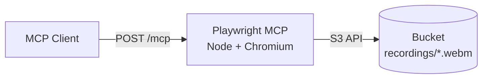

# Remote Playwright MCP

A remote MCP server for operating a real Chromium browser via Playwright, with session screen recordings stored automatically.

## Usage

Ask your agent something like:

> "Open example.com, click 'More information', then end the browser session."

The final response includes a temporary link to the screen recording.

## Available tools

- **`browser_start()`** — Launches Chromium with screen recording enabled.
- **`browser_navigate(url)`** — Navigates the page to `url`.
- **`browser_snapshot()`** — Returns an accessibility/DOM-style tree of the page.
- **`browser_click(ref)`** — Clicks the element with the given ref.
- **`browser_type(ref, text)`** — Types text into the element with the given ref.
- **`browser_end()`** — Closes the browser, finalizes the screen recording, and returns a URL to watch it.

> [!NOTE]
> Only one browser session is allowed at a time per MCP session — call `browser_end()` before starting another.

## Architecture

The app is a single Node process that speaks MCP over HTTP and drives Chromium directly, one browser per session. The bucket is the only other piece of infrastructure, storing each session's screen recording once uploaded.



## Deploying on Railway

1. Create a new Railway project.
2. Deploy this GitHub repo into it — Railway detects the `Dockerfile` automatically.
3. Add a **Bucket** to the project.
4. On the app service, go to **Variables → Connect Service to Bucket**, pick the bucket, choose the **AWS SDK (Generic)** style, and click **Add Variables**.
5. Set `MCP_API_KEY` on the service.
6. Generate a public domain (Settings → Networking → Generate Domain). Your MCP endpoint is `https://<your-domain>.up.railway.app/mcp`.
7. Connect an MCP client to it:
   ```json
   {
     "mcpServers": {
       "playwright-remote": {
         "url": "https://<your-domain>.up.railway.app/mcp",
         "headers": { "Authorization": "Bearer <MCP_API_KEY>" }
       }
     }
   }
   ```

## Running Locally

1. Clone this repo.
2. Install dependencies and the Playwright browser binaries:
   ```
   npm install
   npx playwright install --with-deps chromium
   ```
3. Copy `.env.example` to `.env`. Add your bucket credentials here if you want `browser_end()`'s upload to work locally.
4. Start the server:
   ```
   npm run dev
   ```
5. Connect an MCP client to it:
   ```json
   {
     "mcpServers": {
       "playwright-remote": {
         "url": "http://localhost:8080/mcp"
       }
     }
   }
   ```
